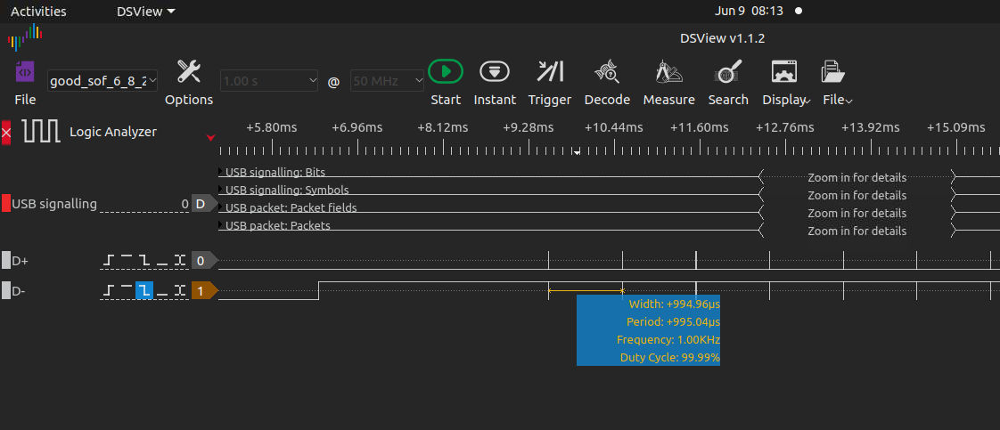
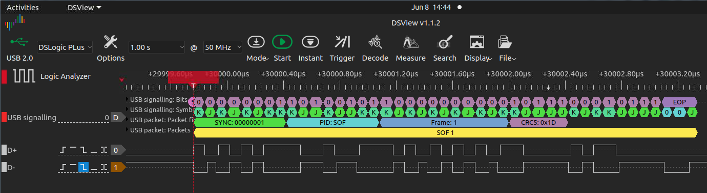
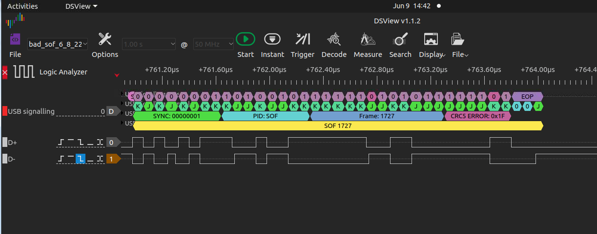
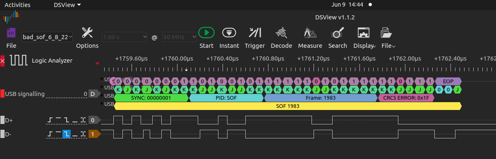
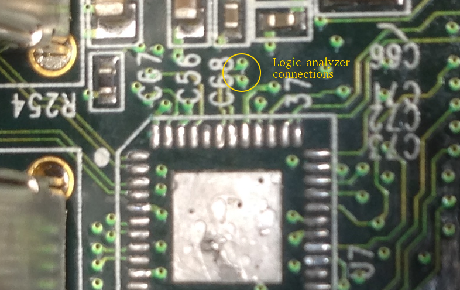
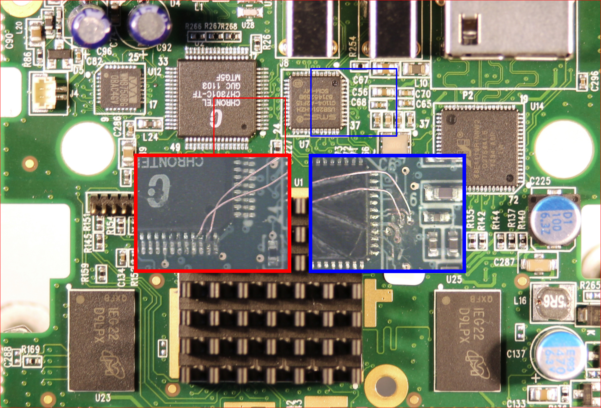
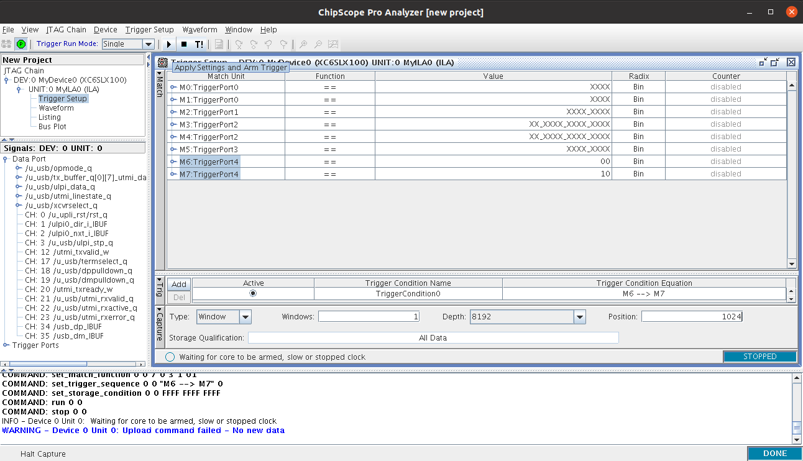
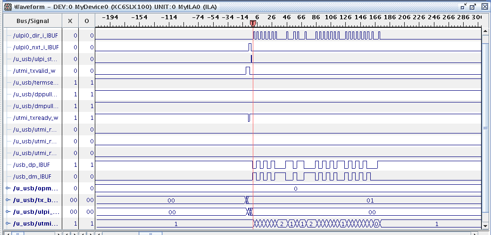
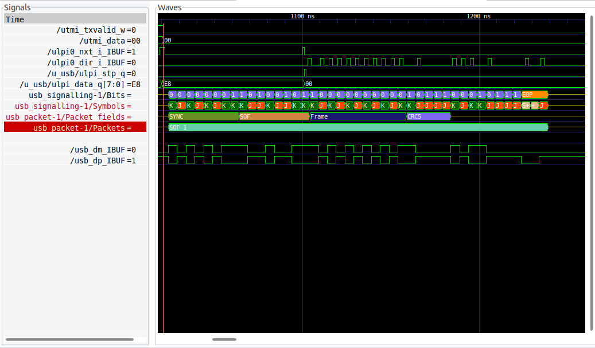

# Detailed Debug notes

## Status

Currently usbhw_reset() wakes up the root hub successfully and Start of
Frame (SOP) packets are generated.  

Sometimes the SOP frames are valid, sometime they are not (see below).

## Decoding USB traffic

I've connected a [logic analyzer](https://www.dreamsourcelab.com/product/dslogic-series/)
between the USB3300 ULPI and the USB2514 USB hub to observe the USB traffic.

The [sigrok](http://sigrok.org/wiki/Main_Page) based software provides USB 
packet decoding which in my opnion is essential for debugging.

I'm committed some interesting traces to the logs subdirectory.

Software to view the traces on Linux, MacOS or Windoze can be downloaded from 
https://www.dreamsourcelab.com/download/ or it can be built from sources
https://github.com/DreamSourceLab/DSView.

Note: A logic analyzer is **NOT** necessary to view the traces.

## Test 1

Call usbhw_reset() then usb_configure_device().

## Case 1 - Valid SOF frames are generated

Some times you win!  These Traces are from good_sof_6_8_22.dsl  

High level view:

Zoomed in on first packet:

## Case 2 - Invalid SOF frames are generated

On other runs (no changes to the .bit file) invalid SOF frames are generated.

Here is the first SOF from bad_sof_6_8_22.dsl:

And here is the second

The first few frame numbers are 1727, 1983, 1, 257, 515, 717, 1029...

The timing between the invalid SOF frames is still correct (1 millisecond)

I suspect a bit or two have been slipped or gained somehow. 

## Logic analyzer connections

The D+ and D- signals between the ULPI and USB hub are routed via vias which
make soldering wires for the logic analyzer connection slightly easier (and
less risky) than solding to the chip pins.  

On my rev C the vias are under the C68 silkscreen, this picture of a rev B
from my usb_sniffer project will give you an idea (ignore the missing hub
chip!)

After scraping off the slik screen and solder mask I tack soldered two
wirewrap wires to the vias to provide a connection point for my logic
analyzer.

## No logic analyzer? No problem!

You can use Xilinx Chipscope to capture internal and external signals, the 
trick is to connect the USB DP and DM signal back to unused IO pins on the 
FPGA, in this case Chrontel HDMI controller pins `data0 (T18)` and `data1 
(U16)` were chosen.

Once this is done, you can use the Xilinx `analyzer` tool to load the 
corresponding `.bit` and `.cdc` files with the description of the *Integrated 
Logic Analyzer*, there is a [sample fpga.cdc file provided](./fpga/fpga.cdc) 
which is good for USB debugging.

To include the ILA in the build, you must have the latest pano submodule and 
have the environment variable `USE_CHIPSCOPE=TRUE` set at the build stage.

Now you need to configure the trigger options to capture what you need within 
the Xilinx tool.

Once a capture is complete, you have the option to export the waveforms in 
`.vcd` format for further analysis.

Using this [excellent script by Sylvain Munaut](https://gist.github.com/smunaut/4239a17ea116d5ddfdaecad381f712e9) 
together with [sigrok](https://sigrok.org/wiki/Sigrok-cli) you can interpret 
the captured USB signal inside [GTKWave](http://gtkwave.sourceforge.net/), 
you should use [the usb.sh file provided in the latest pano repository](https://github.com/skiphansen/pano_blocks/tree/master/tools/analyzer) as a GTKWave *Transaction Filter Process*.

To make the ILA work you need a Xilinx platform cable or you can also use a 
cheap/ubiquitous device like a Rasperry Pi, Raspberry Pico, ESP8266, etc as 
a [Xilinx Virtual Cable device](https://github.com/search?q=xvc+jtag).

## Dream Source Labs

Just as an aside, I know Dream Source Labs had a rocky startup with the 
[sigrok](http://sigrok.org/wiki/Main_Page) community, but I feel they are 
living up to the GPL.  

Dream Source has not only released their fork of Sigrok on github they are
actively maintaining it PUBLICALLY.  If fact the last commit was today.

I fully endorse their DSLogic Plus product, I think it's one of the best
purchases I've made.  Just beware there are DSLogic (without the plus) 
logic analyzers on ebay that lack the 256M bit buffer. The difference is
just a DRAM chip, but save yourself the hassle and make sure you get the
"plus" version. 

## Conclusions

1. The ULPI connections and clock generation are correct since valid USB
packets are seen on some runs.  I've measured the USB 1.1 bit timings with
my scope and they appear to be correct.

2. The fact that I get radically different results on different runs leads me
to think the USB code reset isn't working correctly or there are clock
domain crossing issues.

